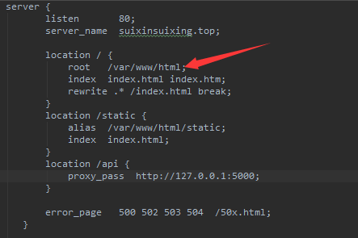

## 链家房价数据分析[线上地址](http://suixinsuixing.top).


### 运行项目
```
    克隆到本地
    git clone https://github.com/SwithunHan/antd-pro.git
    
    安装项目依赖
    npm install
    
    本地运行项目
    npm run dev
```
在本地查看项目[127.0.0.1:8000](http://127.0.0.1:8000)
   
### 部署项目到服务器

    打包项目
    npm run build
   
    将build文件夹里面的文件上传到服务器部署路径和下图nginx配置路径保持一致
    同时将项目中nginx文件夹下的dataWrapper.conf文件配置到nginx上
    
dataWrapper.conf具体配置

 
    
nginx具体配置参考[nginx官网](http://nginx.org/)


